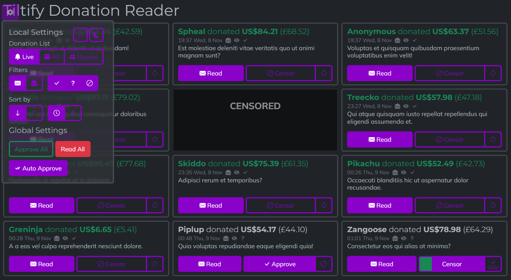

> Project superseded by [ericthelemur/nodecg-dono-control](https://github.com/ericthelemur/nodecg-dono-control) - a rewrite in React

# tiltify-control

Tiltify Control provides a donation reader and moderation interface for Tiltify Donations. Both as a reliable donation reader and to allow approval/censorship of donation messages before they are shown on stream. 

By default, it requires manual approval of each message before it is displayed, however if the auto approval setting is on, messages are automatically approved if not censored within the time window configured (default: 15s).

There are fairly extensive filtering options too: options to allow any of read & unread, approved, censored, unmoderated, and sort by time or money ascending or descending. Viewing the `allDonations` list (no moderation) or donations by top donors are options too.

If you want donation amounts in a different currency to what Tiltify provides, set `displayCurrency` to the currency code e.g. `GBP` and `conversionRateKey` to a key for [freecurrencyapi.com](https://freecurrencyapi.com).

tiltify-control is a [NodeCG](http://github.com/nodecg/nodecg) bundle for `^1.9.0`. It requires [ericthelemur/nodecg-tiltify](https://github.com/ericthelemur/nodecg-tiltify) to fetch the Tiltify data (a minor fork of [daniellockard/nodecg-tiltify](https://github.com/daniellockard/nodecg-tiltify)).

## Installation

1. Install [ericthelemur/nodecg-tiltify](https://github.com/ericthelemur/nodecg-tiltify) (replace daniellockard/nodecg-tiltify) with `nodecg install ericthelemur/nodecg-tiltify`
    - I highly recommend setting up a webhook, but this does require an exposed HTTPS server, which is a bit of a faff for dev
2. Run `nodecg defaultconfig tiltify-control` to generate a blank config
3. Run NodeCG
4. Open the graphic `tiltify-control/tiltify-dono-live.html`
    - If you have authentication on (you should if you have it exposed for the webhook), sharing the link with the `key` param is sufficient if you want to give people access without logging in
